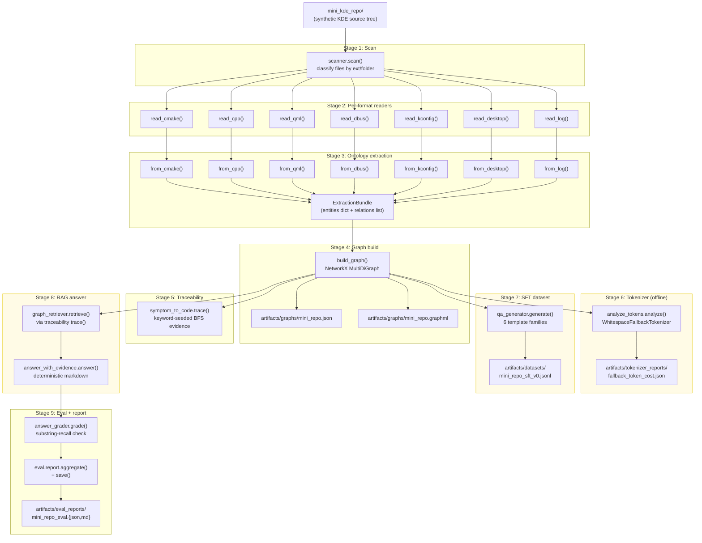

# Architecture

## High-level purpose

`kde_ontology_slm_lab` is a teaching lab that turns a KDE source tree into a
structured knowledge graph and uses that graph to fine-tune small language
models (SLMs) on KDE-specific tasks. The pipeline is entirely offline by
default: no network calls, no GPU required, no model weights downloaded. A
synthetic mini KDE repo (`examples/mini_kde_repo`) gives every stage something
to chew on so learners can run the full vertical slice on any laptop.

The lab's research question is: *can a mixture of LoRA adapters, each
specialising in one KDE task family, outperform a generic SLM on
architecture/debugging/tool-use questions about KDE code?*

---

## Main components

| Component | Package | Role |
|---|---|---|
| Scanner | `src.repo_ingest.scanner` | Walk a repo and classify files by extension/folder |
| Per-format readers | `src.repo_ingest.*_reader` | Parse one file kind into a typed read result |
| Ontology schema | `src.ontology.schema` | Canonical Entity + Relation types |
| Ontology extractor | `src.ontology.extractor` | Translate reader output into Entity/Relation objects |
| Graph builder | `src.graph.builder` | Build a NetworkX MultiDiGraph; serialise JSON/GraphML |
| Graph queries | `src.graph.queries` | Named structural queries over the graph |
| Traceability | `src.traceability.symptom_to_code` | Keyword-seeded BFS evidence chain from symptom to code |
| Tokenizer analyser | `src.tokenizer.analyze_tokens` | Token-cost report for KDE terms; offline fallback |
| SFT dataset generator | `src.dataset.qa_generator` | Template-driven Q&A record generation from the graph |
| JSONL I/O | `src.dataset.jsonl_writer` | Read/write JSONL files; the shared persistence format |
| RAG retriever | `src.rag.graph_retriever` | Route a query through traceability to get ranked evidence |
| Hybrid search | `src.rag.hybrid_search` | Reciprocal-rank fusion of graph retriever + vector store |
| Vector store | `src.rag.vector_store` | In-memory cosine-similarity index over numpy arrays |
| Embeddings | `src.rag.embeddings` | Whitespace-fallback embedder; pluggable for HF models |
| Answer renderer | `src.rag.answer_with_evidence` | Compose a deterministic markdown answer from evidence |
| Eval set | `src.eval.eval_set_builder` | Six hand-authored eval questions for the mini repo |
| Grader | `src.eval.answer_grader` | Substring-recall grader; no LLM needed |
| Eval reporter | `src.eval.report` | Aggregate grades into JSON + Markdown reports |
| Task router | `src.training.train_router` | Rule-based router mapping prompts to one of 7 LoRA adapters |
| Training modules | `src.training.*` | LoRA/QLoRA configs, SFT loop stubs, GGUF export — scaffolded |
| Observability | `src.observability.*` | JSONL metrics sink + optional Prometheus; JSONL trace spans |
| CLI | `src.cli.*` | Click command group (`kde-lab`) with 6 subcommands |
| Common utilities | `src.common.*` | Canonical paths, YAML config loader, logger, ID generator |

---

## Data flow

The diagram below traces the exact execution order of
`examples/run_mini_repo_pipeline.py`.



Note: Stages 6-8 are fully functional with the offline fallback tokenizer and
the rule-based retriever. No model weights are needed.

---

## Control flow

### End-to-end pipeline (script)

```
python examples/run_mini_repo_pipeline.py
```

1. `ensure_dirs()` — create `artifacts/` subtree.
2. `scan(MINI_REPO)` — produce `ScanReport`.
3. For each file kind: `read_*(sf.path)` → `from_*(bundle, result)` — fill
   `ExtractionBundle`.
4. `build_graph(bundle)` → `save_json()` + `save_graphml()`.
5. `trace(g, symptom, k=4)` — sanity-print evidence count to the log.
6. `analyze()` + `save_report()` — write tokenizer report.
7. `generate_sft(g)` + `write_jsonl()` — write JSONL dataset.
8. For each eval item: `answer(g, question, k=6)` → `grade(a.text, item)`.
9. `aggregate(grades)` + `save_report()` — write JSON + Markdown eval report.
10. `write_jsonl(onto_path, ...)` — dump ontology entities for notebook use.

### CLI command dispatch

```
kde-lab [subcommand] [options]
```

`src.cli.main:main()` registers all six subcommands lazily (heavy imports
happen only when the subcommand is actually invoked) and then calls
`cli()` (a Click group).

The subcommand chain for a typical user session is:

```
kde-lab ingest  →  artifacts/ontology/  +  artifacts/graphs/
kde-lab graph   →  (re-export from persisted ontology)
kde-lab tokenizer
kde-lab dataset
kde-lab eval
kde-lab train   →  (dry-run; prints recipe; no training launched in v0)
```

### Task routing (inference-time concept)

When a user sends a query at inference time, `train_router.route(query)` maps
it to one of seven adapters using ordered regex rules. The first matching rule
wins. This is the v0 rule-based router; a learned classifier is the planned
upgrade path.

---

## External dependencies

### Required (always installed)

| Package | Version | Use |
|---|---|---|
| `networkx` | >=3.0 | Knowledge graph (MultiDiGraph) |
| `numpy` | >=1.26 | Vector store, tokenizer arrays |
| `pyyaml` | >=6.0 | Config loading |
| `click` | >=8.1 | CLI framework |
| `tqdm` | >=4.66 | Progress bars |
| `rich` | >=13.0 | Terminal formatting |

### Optional extras

| Extra | Packages | Unlocks |
|---|---|---|
| `[tokenizer]` | `tokenizers`, `transformers` | Real HF tokenizer in `analyze_tokens` |
| `[train]` | `torch`, `transformers`, `peft`, `trl`, `accelerate`, `datasets`, `bitsandbytes` (Linux) | LoRA fine-tuning loop |
| `[rdf]` | `rdflib` | RDF/OWL ontology export |
| `[viz]` | `matplotlib`, `graphviz` | Graph visualisation |
| `[obs]` | `prometheus-client` | Prometheus metrics endpoint |
| `[dev]` | `pytest`, `ruff` | Tests and linting |

All optional deps have a silent fallback: the lab runs fully without any of
them (offline mode, whitespace tokenizer, JSON metrics sink).

---

## Configuration model

Configuration lives in `configs/` as plain YAML files. `src.common.config.load_yaml`
loads them with a graceful fallback to `{}` when a file is absent.

| File | Consumed by | Controls |
|---|---|---|
| `repos.yaml` | `kde-lab ingest` | Which repo paths to scan; include/exclude globs; enabled flag |
| `models.yaml` | `kde-lab train`, `kde-lab info` | Base model ids, LoRA family, max_seq_length |
| `training.yaml` | `kde-lab train` | LoRA hyperparameters, optimiser settings, GPU profiles |
| `tokenizer.yaml` | `kde-lab tokenizer` | Report output path, term lists |
| `dataset.yaml` | `kde-lab info` (summary), dataset generation | Generator toggles |
| `eval.yaml` | `kde-lab info`, `kde-lab eval` | Benchmark declarations |
| `ontology.yaml` | Future: ontology extension | (Currently informational) |

Resolution rule for `training.yaml`: top-level keys are the defaults;
`profiles.<name>` is a partial dict that is deep-merged over the defaults.
CLI flags (`--profile`, `--model-key`) override the config.

All paths in config files are resolved relative to `REPO_ROOT`
(`src.common.paths.REPO_ROOT`) when not absolute.

---

## Error handling model

- **Missing config files**: `load_yaml` returns `{}` silently; each CLI command
  checks required keys and raises `click.ClickException` with a human-readable
  message.
- **Disabled or absent repos**: `kde-lab ingest` raises `ClickException`
  immediately rather than silently skipping.
- **Unknown entity/relation types**: `Entity.__post_init__` and
  `Relation.__post_init__` raise `ValueError` eagerly. This prevents silent
  ontology drift.
- **Dangling graph edges**: `build_graph` drops edges whose source or
  destination id is not a node, silently. This is a deliberate "clean graph
  over noisy edges" policy documented in the source.
- **Empty symptom / no seed terms**: `trace()` returns an empty `Trace`
  (honest refusal). `answer()` checks for empty evidence and returns a polite
  "I cannot find..." message.
- **Unrecognised model in `kde-lab eval`**: raises `ClickException` stating
  only `rag-baseline` is wired in v0.
- **Training loop**: `kde-lab train` always dry-runs in v0 and prints the
  resolved recipe instead of raising an error.

Logging uses `src.common.logging.get_logger`, which emits structured lines to
stderr with a `trace=<id>` tag on every pipeline action.

---

## Observability model

Two independently usable subsystems in `src.observability`:

### Metrics (`src.observability.metrics`)

- Every observation is appended as a JSON record to
  `artifacts/metrics/run-<trace_id>.jsonl`.
- If `prometheus-client` is installed the same observation is also pushed to
  an in-process Prometheus registry; `start_http_server(port=9101)` exposes
  it for Grafana scraping.
- Label policy: only `repo`, `component`, `task_type`, `split`, `model_family`,
  `adapter_name` are permitted. High-cardinality labels (`file_path`,
  `symbol_id`, ...) are rejected at construction time with `ValueError`.
- Three primitive types: `Counter`, `Gauge`, `Histogram`. A `time_block()`
  context manager wraps Histogram for wall-clock measurements.

### Traces (`src.observability.traces`)

- `span(name, labels)` is a context manager that writes one JSONL record to
  `artifacts/logs/traces-<trace_id>.jsonl` on exit.
- The span tree (parent/child ids) is maintained via a `contextvars.ContextVar`.
- If `opentelemetry` is installed, the same span is also emitted to an OTLP
  collector (e.g. Grafana Tempo) with no code change required.
- Trace id is inherited from the `KDE_OBS_TRACE_ID` environment variable if
  set; otherwise a fresh UUID is generated and written to that variable for
  the process lifetime.

### Pipeline-level tracing

`run_mini_repo_pipeline.py` uses `trace_id()` from `src.common.ids` to tag
every log line, giving a single correlation key across all nine stages without
requiring the full observability module.

---

## Security model

The lab is a local research tool with no authentication, no network servers,
and no secret material. The relevant policies are:

- **No auto-downloads**: the `repos.yaml` policy ("recipes only, no
  auto-downloads") means no clone/fetch runs without user action.
- **No model weights bundled**: `models.yaml` uses `CHANGE_ME` placeholders;
  weights must be obtained separately and pointed to explicitly.
- **License tracking**: every `repos.yaml` entry has a `license:` field; the
  mini repo is `"synthetic"`. Users are responsible for verifying upstream
  licenses before enabling real KDE repos.
- **File paths**: all artifact paths resolve inside `REPO_ROOT/artifacts/`,
  which is a local directory. No user-supplied path reaches a network resource.
- **Label validation in metrics**: the `FORBIDDEN_LABELS` set prevents
  accidental emission of file paths or symbol ids as Prometheus label
  cardinality, which could expose data structure information in a shared
  Prometheus instance.

---

## Extension points

1. **Add a new file format**: add a reader in `src/repo_ingest/`, add the
   extension to `KIND_BY_EXT` in `scanner.py`, add an extractor function in
   `extractor.py`, call it in the pipeline and in `ingest_cmd.py`.

2. **Add a new entity or relation type**: add the string to `ENTITY_TYPES` or
   `RELATION_TYPES` in `src.ontology.schema`. Both sets are `frozenset`;
   `Entity.__post_init__` enforces membership.

3. **Add a new graph query**: add a named function to `src.graph.queries`.
   Functions are small and pure (graph-in, list-out) so they are trivially
   testable.

4. **Add a new SFT template**: add a generator function following the
   `template_*` pattern in `src.dataset.qa_generator` and add it to
   `TEMPLATES`.

5. **Add a new LoRA adapter target**: add a new adapter name to `ADAPTERS` in
   `train_router.py` and a matching rule to `_RULES`.

6. **Swap the vector index**: `VectorStore` exposes `add` / `query` / `save` /
   `load`. Replace it with a FAISS or Chroma implementation with the same
   interface when corpus size grows beyond ~10k entities.

7. **Use a real HF tokenizer**: pass a loaded HF tokenizer object (which
   implements `encode(str) -> list[int]`) to `analyze_tokens.analyze()`. No
   other change needed.

8. **Wire a real training loop**: implement the loop in
   `src/training/hf_peft_sft.py` or `src/training/unsloth_sft.py` and update
   `kde-lab train` to call it when `--no-dry-run` is passed.

---

## Known limitations

- **No incremental ingestion**: every `kde-lab ingest` run rebuilds the full
  ontology from scratch. For large repos this is slow.
- **File-name-based entity ids**: `_norm_source_id` uses only the file
  basename, not the full path. Two files with the same name in different
  directories produce a single merged entity. This is noted in the source as
  "good enough for KDE-scale repos".
- **Keyword-only retriever**: `graph_retriever.retrieve()` delegates entirely
  to the traceability keyword-BFS. Semantic paraphrase ("component that handles
  file listing" vs. "KDirLister") is not handled unless the hybrid search path
  (with a populated vector store) is used.
- **Embedder is a whitespace fallback by default**: `src.rag.embeddings`
  provides a random-projection fallback when no HF model is available. The
  resulting vectors are not semantically meaningful; the hybrid search vector
  leg is effectively noise in offline mode.
- **Eval set is tiny**: six hand-authored questions targeting the mini repo.
  All six questions are about one synthetic application.
- **Training is not launched**: `kde-lab train` always dry-runs in v0. The
  `[train]` extras, a real base model, and a GPU are all required to run the
  actual loop.
- **No CI**: there is no `.github/` directory and no automated test runs on
  push.

---

## Scaffold vs implemented

The table below distinguishes runnable code from aspirational structure.

| Area | Status | Notes |
|---|---|---|
| Scanner + readers | Implemented | All 7 format readers tested |
| Ontology schema | Implemented | 30 entity types, 25 relation types |
| Ontology extractor | Implemented | 7 per-format extractors, all tested |
| Graph builder | Implemented | JSON + GraphML serialisation |
| Graph queries | Implemented | 8 named query functions |
| Traceability | Implemented | Keyword-seeded BFS, tested |
| Tokenizer (offline) | Implemented | WhitespaceFallbackTokenizer; HF tokenizer pluggable |
| SFT dataset generator | Implemented | 6 templates, deduplication, JSONL output |
| RAG answer (graph-only) | Implemented | Deterministic markdown, no LLM |
| Hybrid search | Implemented | RRF fusion, offline embedder fallback |
| Vector store | Implemented | numpy cosine, save/load via .npz |
| Eval grader + reporter | Implemented | Substring recall, JSON + Markdown reports |
| Task router | Implemented | Rule-based, 7 adapters, fully tested |
| Observability (metrics) | Implemented | JSONL sink always on; Prometheus optional |
| Observability (traces) | Implemented | JSONL spans always on; OTLP optional |
| CLI (all 6 subcommands) | Implemented | ingest/graph/tokenizer/dataset/eval run; train dry-runs |
| LoRA training loop | **Scaffolded** | `hf_peft_sft.py`, `unsloth_sft.py` exist but are stubs |
| QLoRA config | **Scaffolded** | `qlora_config.py`, `lora_config.py` define dataclasses only |
| GRPO / RL training | **Scaffolded** | `grpo_optional.py` is a placeholder |
| GGUF / adapter merge | **Scaffolded** | `export_gguf.py`, `merge_adapter.py` are stubs |
| RDF/OWL export | **Scaffolded** | `[rdf]` extra exists; no implementation yet |
| Real-KDE repo ingestion | **Config only** | `repos.yaml` has entries; all disabled by default |
| Learned task router | **Not started** | Plan: 30M distilbert classifier as upgrade path |
